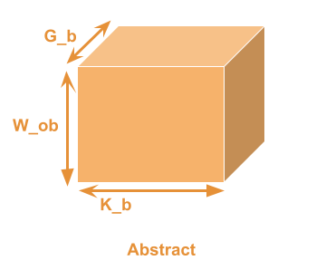
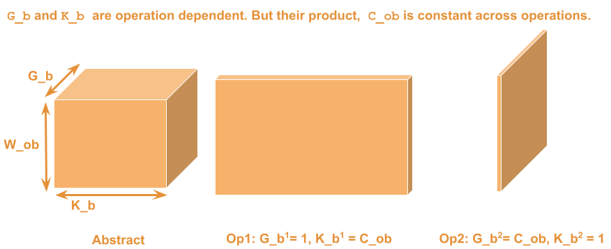

## Description of Macros required to support SMaLL on a new platform

### Kernel Structure
Kernels are used to compose hardware-specific implementations of functionality with hardware-agnostic orchestration code.
Functionality is implemented using macros, which use the shared context of the kernel to interact.  The macros are implemented in a platform-specifc `intrinsics.h` file.

In general, a kernel will have 4 phases : 
1) Definition of a sub-tile of the output C -- `c_tile`, (DEF)
2) Initialization, (ZERO, LOAD, LOAD_STRIDED)
3) Computation in a loop, (CONV_TILE, POOL_TILE, etc)
4) Commit - (optionally) store the result. (STORE)
scope is shared for these 4 phases. Each phase uses 1 or more macros.

The general structure is represented in the pseudocode below
``` c++

template <W_ob, C_ob, UNROLL, ZERO, step>

kernel(num_updates, Activations, Weights, Output)

{

	//define c_tile
	DEF_TILE_C(W_ob, C_ob)
	
	//initialize
	if(ZERO){
		ZERO_TILE_C(W_ob, C_ob)
	} 
	else{
		LOAD_TILE_C(Activations, step, W_ob, C_ob)
	}
	
	//computation loop
	
	for(i = 0; i < num_updates; i+= UNROLL)
	{
		<COMPUTE>_TILE_C(step, Activations, Weigths, W_ob, C_ob)
	}

	//commit c_tile
	STORE_TILE_C(Output, W_ob, C_ob)

}

```

  The same structure can be used for different operations by changing the type of computation used in `<COMPUTE>_TILE_C`.
  
  
### Output tile abstraction `c_tile`
`c_tile` is a 3D tensor. Its height, width and depth are given by W_ob, K_b, and G_b respectively.



For 1 kernel, the volume of c_tile is constant. However, the values of K_b (width) and G_b (depth) are dependent on the specific operation being performed, and affect how input(s) map to the output elements in `c_tile`.

 
  
### Expressing Kernel phases `c_tile`
For the purposes of this discussion, we will treat `c_tile` as a 1D array of scalar elements, and describe the functionality required of the macros using loops over each output dimension. However, for a specific platform, you may use platform-specific vector types or use explicit variables mapping to `c_tile` elements instead of array references. This may even be necessary for performance. We will also abstract over the data type.

#### Definition phase
Since we assume c_tile is an array. This would just be declaring an array called c_tile with the correct number of elements
```cpp
dtype c_tile[W_ob*C_ob];
```
C_ob is the product of G_b and K_b

#### Initialize
We will assume that the dimensions are K_b, G_b, W_ob from fastest to slowest. 
To initialize c_tile with 0, we iterate over each dimensions like:
```cpp
for (int pixel = 0; pixel < W_ob; ++pixel) {
	for (int group = 0; group < G_b; ++group) { 
		for (int channel = 0; channel < K_b; ++channel) { 
			c_tile[pixel * (G_b   *  K_b) + 
							group * (K_b) + 
								   channel] = 0; 
		} 
	} 
}
		
```
NOTE: The ordering of the loops is a representation of the functionality required, you may choose a different order in your instantiation.

In fact, the same set of loops form the foundation of any computation. Below we will talk about how to use input operands such as activations and weights to compute the output.

#### Computing Updates by Indexing Input Operands
Operations in ML inference have up to 2 input operands, activations and weights. The operation specific parameters G_b and K_b are used to control how elements of the input are interpreted.  


The number of  input operand elements required to compute 1 update to `c_tile` is given by
$$ Activations = W_{ob} \times G_b $$
$$ Weights = G_b \times K_b $$

NOTE: The macro can implement UNROLL updates to `c_tile`. This can be represented in the number of elements required as:
$$ Activations = W_{ob} \times G_b \times UNROLL $$
$$ Weights = G_b \times K_b \times UNROLL$$
~The UNROLLed updates always use the `C_ib` dimension of the input operands~

*Stride*
For each input operand, each dimension is associated with a stride. Stride is used to "skip" elements in the input operands to select the ones required by the operation. The strides are given by `W_stride`, `G_stride`, `K_stride`, with the prefix `A_` and `W_` for Activations and Weights respectively. The strides for the Weights are usually 1. So we leave 

><Does this need a picture?>`

Note: If the stride < 1, the number of elements required in that dimension of the input operand is multiplied with the stride. In the extreme case, where stride = 0, a single element from that dimension of the input operand is required.

*Distance*
Distance is the offset between consecutive elements of a dimension of an operand. Similar to stride, these could be denoted as  `W_dist`, `G_dist` ,`K_dist` , `UNROLL_dist`
For the purposes of this discussion, however, we make a simplifying assumption
$$K_{dist} = 1$$
$$G_{dist} = K_b$$
`W_dist` and `UNROLL_dist` must be provided to the macro function.


The general loops to index input operands and output operands are given below. (Modified to include UNROLL)
The UpdateOp is specialized based on the functionality 
```cpp

for (int pixel = 0; pixel < W_ob; ++pixel) {
	for (int group = 0; group < G_b; ++group) { 
		for (int channel = 0; channel < K_b; ++channel) { 
			dtype computed_update = 0.0;
			for(int update = 0; update < UNROLL; ++update) {
				UpdateOP(computed_update,
						Activations[pixel * (A_W_stride * A_W_dist) +
									group * (A_G_stride * A_G_stride) + 
									update * A_UNROLL_dist],
						Weights[group * W_G_dist +
						        channel * W_K_dist +
								update * W_UNROLL_dist]
								); 
			} 
			c_tile[pixel * (G_b   *  K_b) + 
								group * (K_b) + 
									   channel] = computed_update;
		} 
	}
}		
```
Note: Loops can be re-ordered

